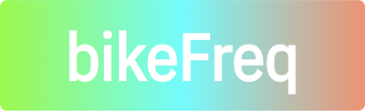

***bikeFreq*** is a homemade, networked game for finding friends and exploring the outdoors.

The game operates on the LoRa protocol's license-free sub-gigahertz radio frequency band using low-powered Arduino development boards mounted on bicycles. The game and related research was developed under the umbrella of [The Street Finds Its Own Uses For Things](http://www.thestreetfindsitsownusesforthings.com), a seminar at [The Cooper Union](https://www.cooper.edu), during the COVID-19 pandemic in New York City.

Read more about the project at the [wiki](https://github.com/dailybicycle/bikeFreq/wiki).
View more context at its channel on Are.na, [here](https://www.are.na/helmuth-rosales/bikefreq) or [here](https://www.are.na/austin-wade-smith/the-street-finds-its-own-uses-for-things)
